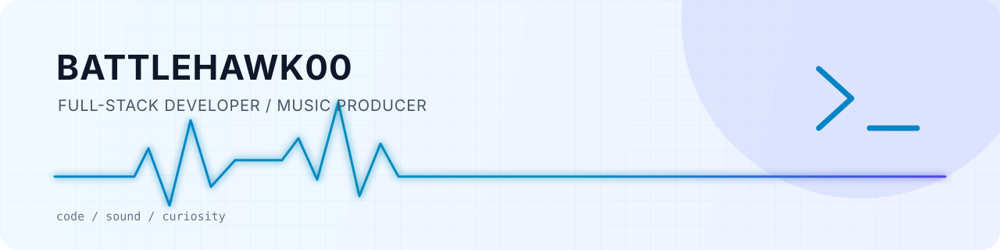

<picture>
  <source media="(prefers-color-scheme: dark)" srcset="./assets/hero-dark.svg">
  <source media="(prefers-color-scheme: light)" srcset="./assets/hero-light.svg">
  
</picture>

  <a href="https://code1024.icu/">Blog</a> ·
  <a href="https://music.163.com/#/user/home?id=66732339">NetEase Music</a> ·
  <a href="https://space.bilibili.com/4916371">Bilibili</a> ·
  <a href="mailto:battlehawk0_0@163.com">Email</a>

## 你好，我是 BATTLEHAWK00 👋

一名喜欢把复杂问题做成实用工具的全栈开发者，也是一名电子音乐制作人。

代码和音乐对我来说很相似：拆解结构、寻找节奏，然后把许多微小的选择组合成一个真正能工作的作品。我长期关注 Web 工程、自托管服务与开发者工具，也一直在学习新的表达方式。

> `while (true) { learn(); build(); share(); }`

## 现在进行时

- 🔭 构建 **[my-info-aggregator](https://github.com/BATTLEHAWK00/my-info-aggregator)**，探索更舒服的个人信息获取与阅读体验
- 🧰 持续打磨 TypeScript / React / Node.js 工程能力，也在接触 Rust 与系统侧工具
- 🎧 制作电子音乐，学习吉他指弹，让技术之外的灵感保持流动

## 一些作品

| Project | What it is | Built with |
| --- | --- | --- |
| **[my-info-aggregator](https://github.com/BATTLEHAWK00/my-info-aggregator)** | 面向个人的信息聚合与阅读工作台 | TypeScript |
| **[BlogNode-dev](https://github.com/BATTLEHAWK00/BlogNode-dev)** | 模块化、轻量、支持主题与插件的博客平台 | Fastify · MongoDB |
| **[hydro-prom-exporter](https://github.com/BATTLEHAWK00/hydro-prom-exporter)** | 为 Hydro OJ 提供可观测性的 Prometheus Exporter | TypeScript · Prometheus |

## 工具箱

  

## GitHub 一览

<picture>
  <source media="(prefers-color-scheme: dark)" srcset="https://github-readme-stats.vercel.app/api?username=BATTLEHAWK00&show_icons=true&hide_border=true&bg_color=00000000&title_color=7dd3fc&icon_color=22d3ee&text_color=cbd5e1&locale=cn">
  <source media="(prefers-color-scheme: light)" srcset="https://github-readme-stats.vercel.app/api?username=BATTLEHAWK00&show_icons=true&hide_border=true&bg_color=00000000&title_color=0369a1&icon_color=0891b2&text_color=334155&locale=cn">
  
</picture>
<picture>
  <source media="(prefers-color-scheme: dark)" srcset="https://github-readme-stats.vercel.app/api/top-langs/?username=BATTLEHAWK00&layout=compact&hide_border=true&bg_color=00000000&title_color=7dd3fc&text_color=cbd5e1&hide=html,css">
  <source media="(prefers-color-scheme: light)" srcset="https://github-readme-stats.vercel.app/api/top-langs/?username=BATTLEHAWK00&layout=compact&hide_border=true&bg_color=00000000&title_color=0369a1&text_color=334155&hide=html,css">
  
</picture>

---

<i>Stay curious. Keep building.</i>

